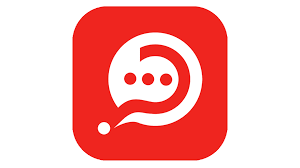

    

    
    
    
    

    ➡️ <a href="https://chat-websocket-ryky.onrender.com/">Website</a>

    
    
    
    
    

# Chat API

## Descripción

Chat API es una plataforma de chat que permite a los usuarios comunicarse entre sí y gestionar sus conversaciones. El backend de la aplicación está construido con Node.js y Express.js, utilizando MongoDB como base de datos para almacenar mensajes, chats y solicitudes de amistad. La aplicación también cuenta con un sistema de autenticación que permite a los usuarios registrarse, iniciar sesión y mantener sesiones seguras.

## Características Implementadas

- **Sistema de Autenticación**: Permite a los usuarios registrarse e iniciar sesión de manera segura.
- **Gestión de Chats**: Los usuarios pueden crear chats, enviar mensajes y ver el historial de mensajes en cada chat.
- **Solicitudes de Amistad**: Los usuarios pueden enviar, aceptar y rechazar solicitudes de amistad.
- **RESTful API**: El backend proporciona una API RESTful para interactuar con la aplicación desde el frontend.

## Tecnologías Utilizadas

### Backend:
- **Node.js**: Entorno de ejecución de JavaScript del lado del servidor.
- **Express.js**: Framework web para Node.js que facilita la creación de API RESTful.
- **MongoDB**: Base de datos NoSQL utilizada para almacenar datos de la aplicación.
- **Mongoose**: ODM (Object-Document Mapping) para MongoDB que proporciona una interfaz sencilla para interactuar con la base de datos.
- **Swagger**: Utilizado para documentar la API RESTful.

### Frontend (parcialmente implementado):
- **EJS**: Motor de plantillas utilizado para renderizar vistas en el servidor.
- **Tailwind CSS**: Framework de CSS utilitario para diseñar interfaces de usuario.

## Instalación

### Prerrequisitos

- Node.js
- MongoDB

### Funcionalidades del Usuario

- **Registro e Inicio de Sesión**: Los usuarios pueden registrarse e iniciar sesión para acceder a la plataforma.
- **Creación de Chats**: Los usuarios pueden crear nuevos chats y enviar mensajes a otros usuarios.
- **Gestión de Solicitudes de Amistad**: Los usuarios pueden enviar, aceptar y rechazar solicitudes de amistad.

### Funcionalidades del Administrador (No implementadas):

- **Administración de Usuarios**: Permitir al administrador ver y gestionar usuarios registrados en la plataforma.

## Estado del Proyecto

El backend de Chat API está completamente implementado y funcional. Sin embargo, el frontend está parcialmente implementado y actualmente se está trabajando en mejorar la funcionalidad y el diseño. Actualmente, el diseño no es responsive debido a que se está priorizando la funcionalidad sobre el diseño.

## Licencia

Este proyecto está bajo la Licencia MIT. Consulta el archivo [LICENSE](LICENSE) para más detalles.

